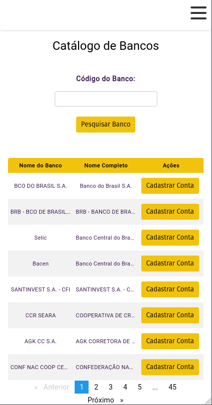

# Visão Geral

O projeto AbasBank é uma aplicação bancária Angular que incorpora recursos, como checagem de formulários, paginação para listar bancos e funções CRUD para criar contas bancárias. A aplicação utiliza a API pública [Brasil API - Bancos](https://brasilapi.com.br/api/banks/v1) para listar bancos e obter detalhes específicos por código.

## Acesso à Aplicação Online

A versão mais recente da aplicação está disponível [aqui](https://abas-bank-joao.vercel.app/). Explore os recursos e funcionalidades oferecidos pela aplicação.


# Paleta de Cores


Aqui estão as cores principais utilizadas neste projeto (foram baseadas no site da abas):

| Nome                | Código Hexadecimal |
|---------------------|---------------------|
| **Botão Principal** |  `#F2C30D` |
| **Cor do Link**     |  `#411c54` |
| **Cor da Etiqueta** |  `#411c54` |
| **Cor do Texto**    |  `#111011` |
| **Cor de Fundo**    |  `#ffffff` |


## Recursos Principais

### Tela de Listagem de Bancos:

- Apresenta uma lista de todos os bancos, utilizando a API pública para obter dados.
- Inclui um campo de pesquisa por código de banco, permitindo ao usuário consultar um banco específico.
- Redireciona para a Tela de Cadastro ao clicar em um banco na lista.

### Tela de Cadastro:

- Exibe todas as informações detalhadas do banco selecionado.
- Possui campos para o usuário informar agência e conta para cadastro.
- Inclui um botão para cadastrar a conta, armazenando as informações no Local Storage.


### Exemplo responsividade do projeto:




## Integração com a API Brasil - Bancos

A aplicação utiliza a [API Brasil - Bancos](https://brasilapi.com.br/docs#tag/BANKS) para listar bancos e obter detalhes específicos. A API é integrada nas telas de listagem e cadastro.

### Tela de Listagem de Bancos

- Listagem de Bancos: [https://brasilapi.com.br/api/banks/v1](https://brasilapi.com.br/api/banks/v1)
- Consulta por Código: [https://brasilapi.com.br/api/banks/v1/{code}](https://brasilapi.com.br/api/banks/v1/%7Bcode%7D)

### Tela de Cadastro

- As informações detalhadas do banco são obtidas pela API.

# Funcionalidades Específicas

## Checagem de Formulários

- Utilização de funcionalidades avançadas de checagem de formulários para garantir a integridade dos dados informados.

## Paginação na Listagem de Bancos

- Implementação de paginação para melhorar a experiência do usuário ao visualizar a lista de bancos.

## Funções CRUD para Contas Bancárias

- Possibilidade de cadastrar contas bancárias, armazenando as informações no Local Storage.

# Instruções Técnicas

### Ambiente de Desenvolvimento

Certifique-se de ter o Angular CLI instalado globalmente em seu ambiente de desenvolvimento:

```bash
npm install -g @angular/cli@17.1.0
```
#### Iniciando o Servidor de Desenvolvimento

```bash
ng serve
```

# Possíveis Melhorias no Projeto

1. Abstração para Chamar Serviços de Forma Desacoplada

Atualmente, estou realizando chamadas diretas para a API pública Brasil API - Bancos. Para melhorar a manutenção e a flexibilidade do meu código, estou considerando criar uma abstração para chamar serviços de forma desacoplada, utilizando inversão de dependência. Isso permitirá uma maior modularidade e facilitará a substituição de serviços no futuro.

2. Aprimoramento da Responsividade

Apesar de apresentar um exemplo de responsividade, estou considerando uma análise mais aprofundada para garantir uma experiência consistente em dispositivos de diferentes tamanhos e resoluções. Estou testando a aplicação em uma variedade de dispositivos e ajustando a responsividade conforme necessário.

3. Melhorias na Interface do Usuário

Estou explorando possibilidades de aprimoramento na interface do usuário, como a inclusão de animações sutis, feedbacks visuais e melhorias no design para tornar a experiência mais agradável e intuitiva.

4. Testes Unitários e de Integração

Estou considerando a implementação de testes unitários e de integração para garantir a estabilidade e o bom funcionamento do meu código ao longo do tempo. Ferramentas como Jasmine e Karma podem ser úteis para esse propósito.
